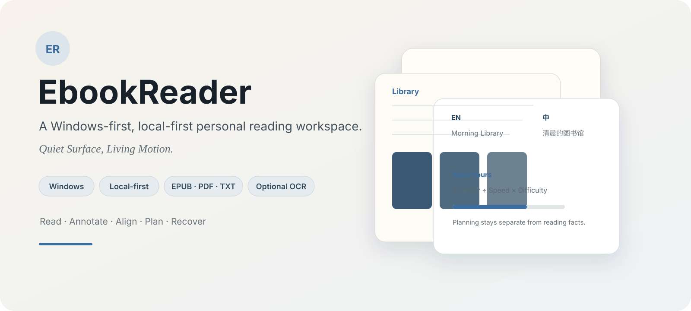
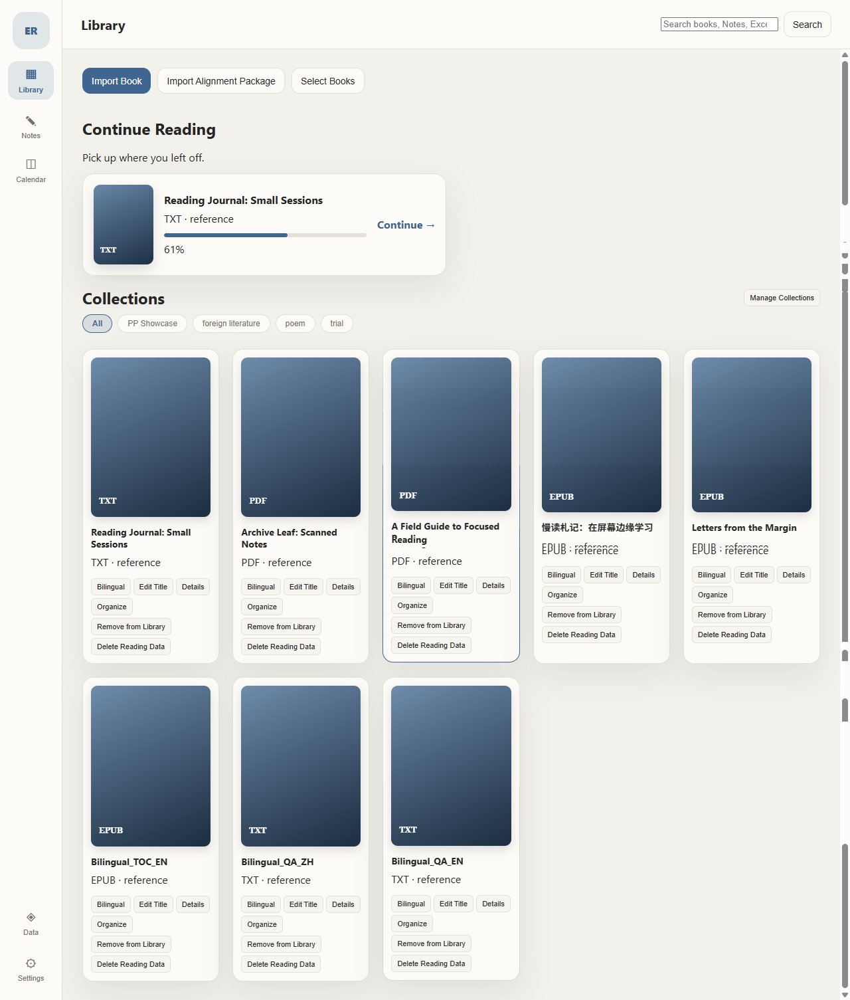
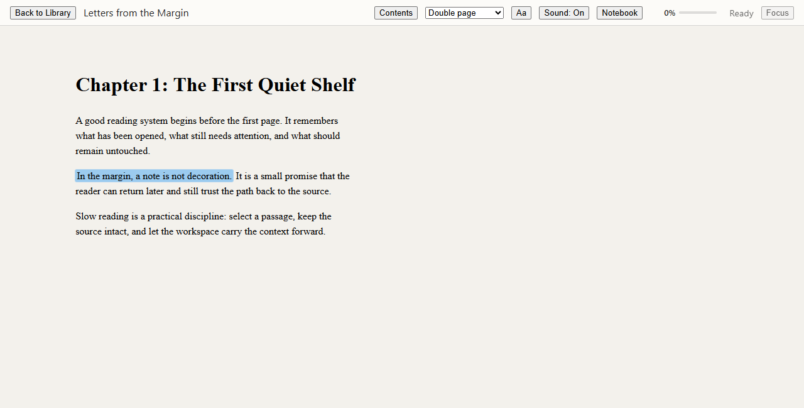
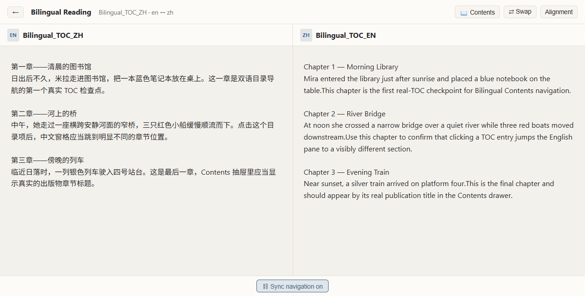
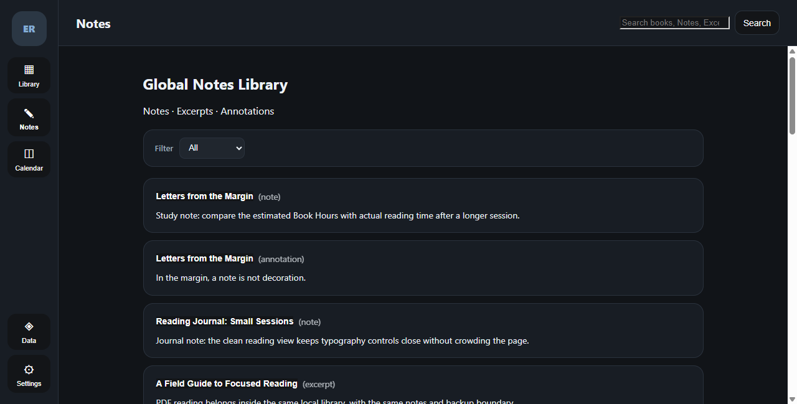
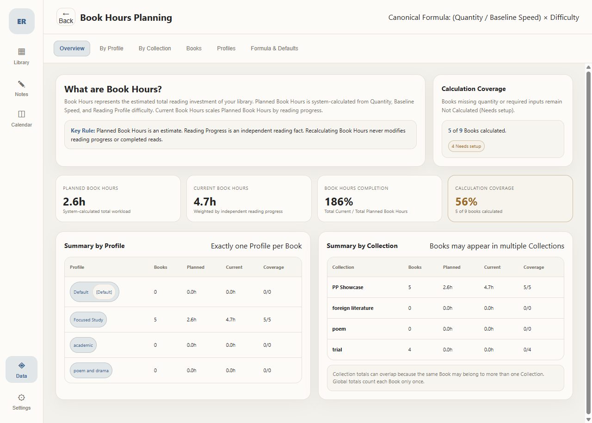
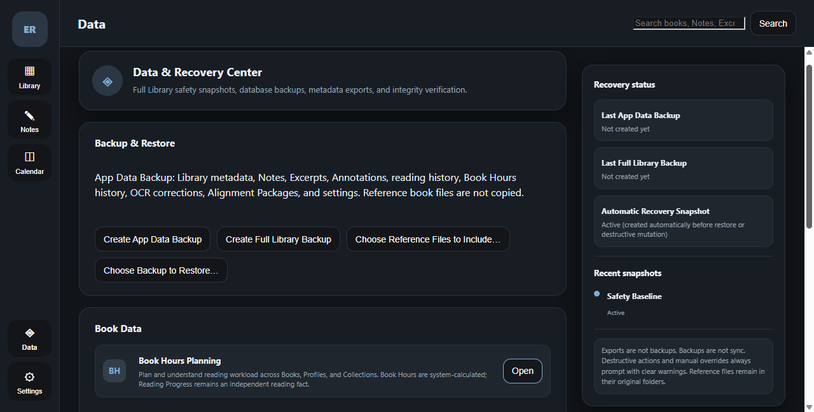

<p align="center">
  
</p>

<p align="center">
  <strong>EbookReader v1.0.0</strong> · Windows-first · Local-first · EPUB / PDF / TXT · Optional local OCR
</p>

<p align="center">
  <a href="https://github.com/Peter-S-Shi/ebookreader/releases/tag/v1.0.0"><strong>Download v1.0.0</strong></a>
  ·
  <a href="PRODUCT_SPEC.md">Product Spec</a>
  ·
  <a href="ARCHITECTURE.md">Architecture</a>
  ·
  <a href="DESIGN.md">Design</a>
</p>

---

## What is EbookReader?

**EbookReader** is a Windows desktop reading workspace built around a simple idea: reading tools should stay quiet while your books, notes, plans, and reading history remain understandable and under your control.

It supports **EPUB, PDF, and TXT**, with persistent reading progress, Notes / Excerpts / Highlights, bilingual aligned reading, Book Hours planning, local backup and restore, and an optional local OCR pack for scanned PDFs.

The product is intentionally **local-first**. Core reading and user data stay on the machine; update awareness is the narrow V1 network exception.

> **Quiet Surface, Living Motion**

---

## Product tour

<table>
  <tr>
    <td width="50%" valign="top">
      
      <br><strong>Library</strong><br>
      Multi-format library, collections, progress, and Continue Reading in one low-noise home surface.
    </td>
    <td width="50%" valign="top">
      
      <br><strong>Focused reading</strong><br>
      EPUB reading with persistent position, typography controls, highlights, notes, and notebook access.
    </td>
  </tr>
  <tr>
    <td width="50%" valign="top">
      
      <br><strong>Bilingual reading</strong><br>
      Two independent books with synchronized navigation, side swap, contents navigation, and alignment inspection.
    </td>
    <td width="50%" valign="top">
      
      <br><strong>Global Notes Library</strong><br>
      Notes, excerpts, and annotations stay tied to their source books and can be reviewed across the library.
    </td>
  </tr>
  <tr>
    <td width="50%" valign="top">
      
      <br><strong>Book Hours</strong><br>
      A transparent planning model for estimated reading workload, separated from factual reading progress and time.
    </td>
    <td width="50%" valign="top">
      
      <br><strong>Data & Recovery</strong><br>
      App-data backup, full-library backup, restore, recovery snapshots, and explicit data-safety boundaries.
    </td>
  </tr>
</table>

---

## Why this project is different

### Book Hours: planning without rewriting reality

Book Hours is a first-class planning model rather than a manually entered target.

```text
Planned Book Hours = (Quantity / Baseline Speed) × Difficulty

Current Book Hours = Planned Book Hours × Cumulative Reading % / 100
```

- **Quantity** is format-aware: pages, words, or characters.
- **Baseline Speed** is unit-specific and configurable.
- **Difficulty** comes from one Reading Profile per book.
- **Reading Progress remains an independent fact.**
- Recalculation never rewrites reading progress, Actual Reading Time, or session history.
- Missing inputs produce a truthful **Needs setup / Not calculated** state instead of synthetic `0h`.

### Bilingual reading: synchronized navigation, independent book data

Bilingual reading pairs two real books without collapsing them into one document. Each side keeps its own reading state and annotations while navigation can remain synchronized.

### Optional local OCR

Scanned PDFs remain visually readable without OCR. Users who need text recognition can install the standalone **EbookReader Optional OCR Pack**.

- Core installer stays lightweight.
- OCR runs locally through ONNX Runtime.
- No cloud OCR dependency.
- OCR corrections are preserved as user data.
- Missing OCR assets are treated as an optional-component state, not a broken reader.

### Recovery is part of the product, not an afterthought

The Data & Recovery Center makes backup and restore explicit. It distinguishes app data from reference files, creates safety snapshots before destructive recovery operations, and keeps local file ownership visible to the user.

---

## Core capabilities

| Area | V1 capabilities |
|---|---|
| **Reading** | EPUB, PDF, TXT; persistent position/progress; rereads; format-aware controls |
| **Annotations** | Notes, Excerpts, Highlights / Annotations, source-linked navigation |
| **Organization** | Collections, library multi-select, soft removal from library |
| **Planning** | Book Hours, Reading Profiles, Collection workload views, Calendar |
| **Bilingual** | Alignment Packages, synchronized reading, independent book data |
| **OCR** | Optional local OCR pack for scanned PDFs, correction workspace |
| **Reliability** | SQLite persistence, app-data backup, full-library backup, restore, recovery snapshots |
| **Preferences** | Light / dark appearance, typography, reading settings, update awareness |

---

## Architecture & stack

EbookReader is a **Tauri 2** desktop application with a React / TypeScript frontend and a Rust core.

- **Desktop shell:** Tauri 2
- **Frontend:** React, TypeScript, Vite
- **Core / persistence:** Rust + SQLite (`rusqlite`)
- **EPUB:** Foliate.js
- **PDF:** PDF.js
- **OCR:** ONNX Runtime + PaddleOCR model assets in the optional OCR pack
- **Platform target:** Windows-first

The repository deliberately separates authority between product semantics, UI semantics, architecture, and delivery state instead of letting one document silently redefine another.

| Concern | Canonical document |
|---|---|
| Product / domain semantics | [`PRODUCT_SPEC.md`](PRODUCT_SPEC.md) |
| UI / interaction semantics | [`DESIGN.md`](DESIGN.md) |
| Architecture | [`ARCHITECTURE.md`](ARCHITECTURE.md) |
| Format behavior | [`FORMAT_CAPABILITY_MATRIX.md`](FORMAT_CAPABILITY_MATRIX.md) |
| Delivery / lifecycle | [`ROADMAP.md`](ROADMAP.md) |
| Manual acceptance | [`MANUAL_QA.md`](MANUAL_QA.md) |
| Current project state | [`PROJECT_STATUS.md`](PROJECT_STATUS.md) |

---

## Release engineering

**v1.0.0** is the first stable public release.

The release process included:

- full automated regression and native human acceptance;
- packaged Windows RC verification;
- clean Windows 11 VM installation and relaunch testing;
- recursive packaged-runtime dependency closure auditing;
- persistence, backup, restore, and recovery validation;
- Optional OCR Pack installation and live OCR smoke testing;
- release-identity consistency checks and CI promotion gates.

Release artifacts:

- `EbookReader_1.0.0_x64-setup.exe` — standard NSIS installer
- `EbookReader_1.0.0_x64_en-US.msi` — MSI installer
- `EbookReader_OCR_Pack_1.0.0_x64-setup.exe` — optional local OCR pack

➡️ **[Download EbookReader v1.0.0](https://github.com/Peter-S-Shi/ebookreader/releases/tag/v1.0.0)**

---

## Build from source

Prerequisites:

- Windows
- Node.js / npm
- Rust toolchain compatible with the repository
- Tauri 2 prerequisites

```powershell
npm install
npm run tauri dev
```

Production build:

```powershell
npm run tauri build
```

The optional OCR pack has its own packaging path and is intentionally not bundled into the lightweight Core installer.

---

## Product and engineering notes

This repository preserves the engineering trail behind the release rather than presenting the app as a one-shot demo.

Useful starting points:

- [`PRODUCT_SPEC.md`](PRODUCT_SPEC.md) — frozen V1 product contract
- [`DESIGN.md`](DESIGN.md) — **Quiet Surface, Living Motion** design authority
- [`ARCHITECTURE.md`](ARCHITECTURE.md) — accepted architecture baseline
- [`ROADMAP.md`](ROADMAP.md) — milestone gates and delivery evidence
- [`FEATURE_COMPLETE_CANDIDATE_REPORT.md`](FEATURE_COMPLETE_CANDIDATE_REPORT.md) — feature-complete reconciliation
- [`PROJECT_STATUS.md`](PROJECT_STATUS.md) — current lifecycle state

The project prioritizes **engineering credibility over novelty claims**: clear contracts, explicit trade-offs, human gates, regression evidence, real packaging, and recoverable user data.

---

## Privacy

EbookReader is local-first.

- Reading files and user data are not uploaded by the core product.
- OCR inference is local.
- Update awareness is the narrow V1 network exception.
- Local/private planning material and non-redistributable reading corpora are intentionally excluded from the public repository.

---

## Release

**Current stable release:** [`v1.0.0`](https://github.com/Peter-S-Shi/ebookreader/releases/tag/v1.0.0)

Windows Core installers and the Optional OCR Pack are published on the GitHub Release page with SHA256 checksums and third-party notices.
