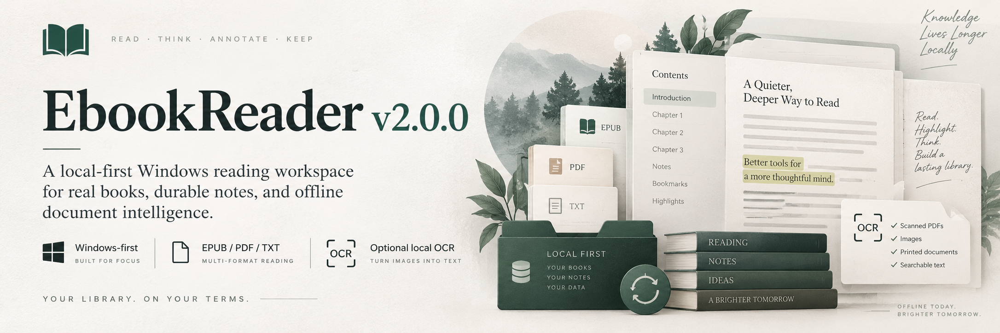
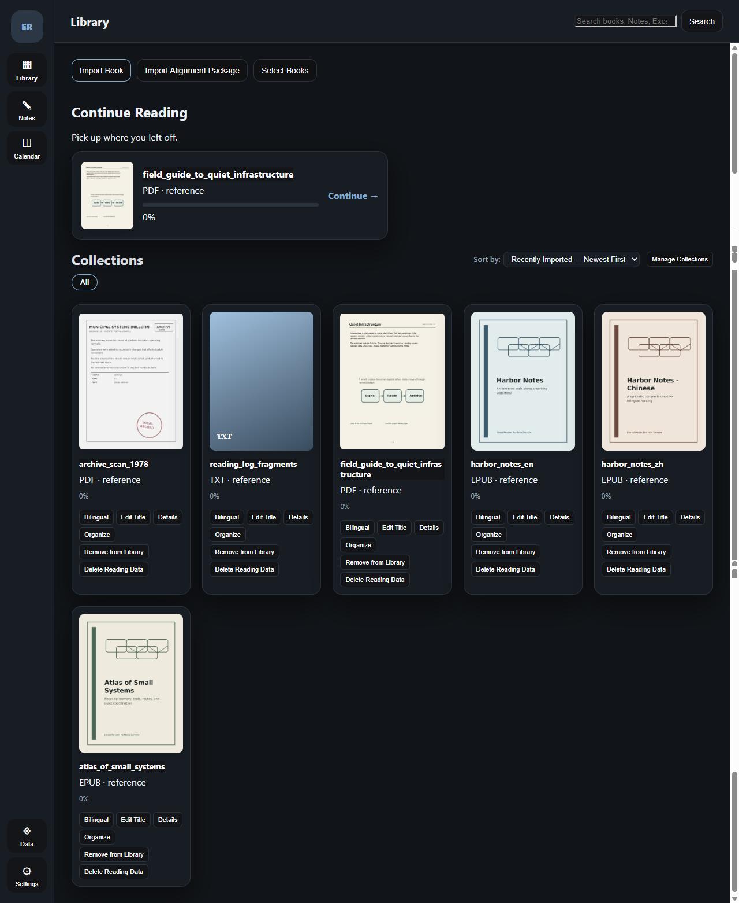
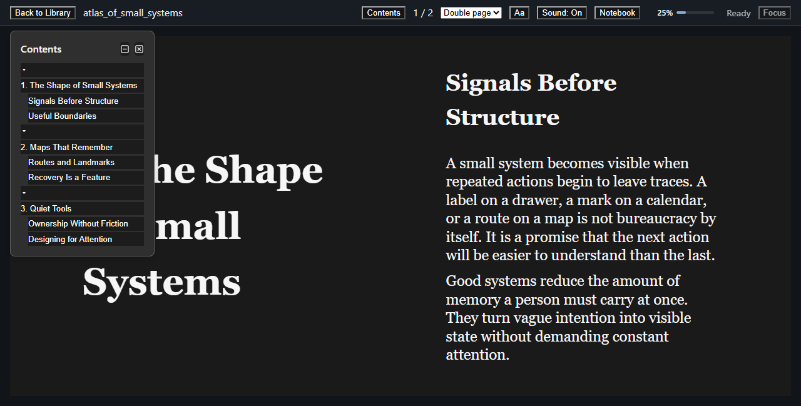
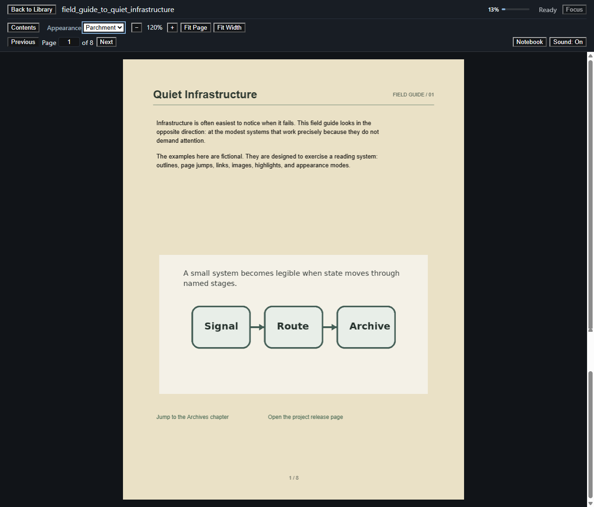
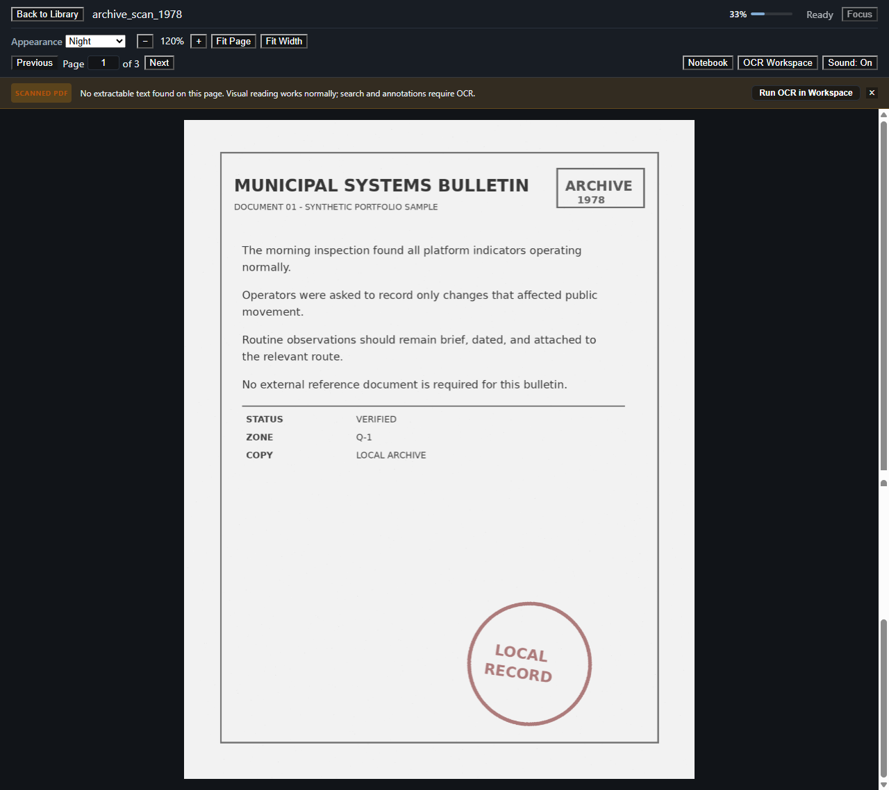
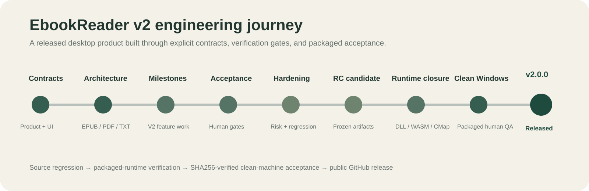

# EbookReader

<p align="center">
  
</p>

<p align="center">
  <strong>A local-first Windows reading workspace for real books, durable notes, recoverable reading data, and optional on-device OCR.</strong>
</p>

<p align="center">
  Read EPUB, PDF, scanned PDF, and TXT without turning your personal library into a cloud account.
</p>

<p align="center">
  <a href="https://github.com/Peter-S-Shi/ebookreader/releases/tag/v2.0.0"><strong>Download v2.0.0</strong></a>
  ·
  <a href="#see-it-in-action">See it in action</a>
  ·
  <a href="#engineering-depth">Engineering</a>
  ·
  <a href="ARCHITECTURE.md">Architecture</a>
</p>

<p align="center">
  <a href="https://github.com/Peter-S-Shi/ebookreader/actions/workflows/ci.yml"></a>
  <a href="https://github.com/Peter-S-Shi/ebookreader/releases"></a>
  
  
  
</p>

EbookReader is built around a simple idea: **a reading tool should help you stay with the document while keeping the durable record of your reading understandable and under your control.**

The application treats EPUB, PDF, scanned PDF, and TXT as different document systems rather than pretending they are one generic text surface. At the same time, progress, annotations, planning, bilingual reading, OCR corrections, backup, restore, and recovery live in one coherent Windows desktop workspace.

---

## Why EbookReader?

<table>
<tr>
<td width="33%" valign="top">

### 📚 Real-world document reading

EPUB, PDF, scanned PDF, and TXT keep format-aware behavior while sharing one reading workspace. Navigation, typography, page appearance, annotations, and OCR are handled where they actually belong.

</td>
<td width="33%" valign="top">

### 🔒 Local ownership & recovery

Books and reading data stay local by default. SQLite persistence, backup, restore, recovery snapshots, and durable OCR corrections make recoverability part of the product instead of an afterthought.

</td>
<td width="33%" valign="top">

### 🛠️ Built beyond the demo stage

The v2 release passed hardening, automated regression, packaged runtime-closure checks, Windows installer generation, clean Windows 11 acceptance, SHA256 artifact verification, and public release promotion.

</td>
</tr>
</table>

---

## See it in action

<table>
<tr>
<td width="50%" valign="top">
  
  <br><strong>Library</strong><br>
  EPUB, PDF, scanned PDF, and TXT in one local library with covers, progress, collections, and multilingual sorting.
</td>
<td width="50%" valign="top">
  
  <br><strong>EPUB reading</strong><br>
  Page-based reading, hierarchical Contents navigation, typography preferences, embedded covers, highlights, and durable reading position.
</td>
</tr>
<tr>
<td width="50%" valign="top">
  
  <br><strong>PDF reading</strong><br>
  Direct page navigation, native outlines and links, highlights, local CMaps / WASM decoders, and image-aware Page Appearance modes.
</td>
<td width="50%" valign="top">
  
  <br><strong>Optional local OCR</strong><br>
  Scanned PDFs remain readable without OCR; the optional pack adds local recognition, correction, persistence, and zero-configuration discovery.
</td>
</tr>
</table>

The screenshots above use a synthetic portfolio corpus created specifically for public demonstration rather than the author's private reading library.

---

## What you can do

- **Read EPUB, PDF, and TXT** with persistent position and progress.
- **Use validated page-based EPUB and PDF reading modes** while native TXT keeps its scrolling behavior.
- **Navigate structured documents** with hierarchical EPUB Contents, native PDF outlines, and direct PDF page jumps.
- **Tune EPUB typography** even when publisher styles aggressively define their own font size, line height, margins, or width.
- **Use five PDF Page Appearance modes** while protecting embedded raster imagery from destructive global filtering.
- **Follow native PDF links**, including internal destinations and confirmed external HTTP/HTTPS links.
- **Highlight and annotate** with source-linked navigation and a global Notes Library.
- **Organize a multilingual library** with collections, multi-select, natural sorting, and Simplified Chinese pinyin collation.
- **Plan reading workload with Book Hours** without rewriting factual progress or session history.
- **Pair two books for bilingual reading** while keeping each book's data independent.
- **Install the Optional OCR Pack** for local scanned-PDF recognition and persistent OCR corrections.
- **Back up, restore, and recover** app data and library state with explicit safety boundaries.

---

## Product depth

EbookReader contains product ideas that sit above the rendering layer.

<table>
<tr>
<td width="50%" valign="top">
  
  <br><strong>Bilingual reading</strong><br>
  Pair two real books without collapsing them into one document. Each side keeps its own annotations and reading state while navigation can remain synchronized.
</td>
<td width="50%" valign="top">
  
  <br><strong>Book Hours</strong><br>
  A transparent workload model that keeps planning separate from factual reading progress and actual reading time.
</td>
</tr>
</table>

### Book Hours: planning without rewriting reality

```text
Planned Book Hours = (Quantity / Baseline Speed) × Difficulty

Current Book Hours = Planned Book Hours × Cumulative Reading % / 100
```

- **Quantity** is format-aware: pages, words, or characters.
- **Baseline speed** is unit-specific and configurable.
- **Difficulty** comes from one Reading Profile per book.
- Recalculation does not rewrite reading progress, actual reading time, or session history.
- Missing inputs remain a truthful **Needs setup / Not calculated** state instead of becoming synthetic `0h`.

---

## One workspace, format-aware readers

EbookReader does not force every document through one rendering path.

```text
Local Library
    │
    ├── EPUB ──→ Foliate.js
    │             ├─ page-based reading
    │             ├─ typography overrides
    │             └─ Contents / highlights
    │
    ├── PDF ───→ PDF.js
    │             ├─ outlines / links / page jump
    │             ├─ CMaps + WASM decoders
    │             ├─ Page Appearance
    │             └─ OCR eligibility
    │
    └── TXT ───→ native text reading
                  └─ scrolling + position indicator
```

That format-aware boundary is one of the project's central architectural decisions: product semantics stay shared where they should be shared, while document-specific behavior stays explicit.

---

## Local-first by design

```text
Your local books
      │
      ▼
EbookReader
      │
      ├── SQLite reading state
      ├── notes / excerpts / highlights
      ├── reading sessions and progress
      ├── OCR corrections
      └── backup / restore / recovery snapshots
```

Core reading data is local. OCR inference is local when the Optional OCR Pack is installed.

Update awareness is the deliberately narrow network exception; EbookReader does **not** claim that every feature is permanently network-silent.

---

## Engineering depth

EbookReader is also a software-engineering portfolio project. The repository records the work required to turn a multi-format reader into a packaged, clean-machine-tested Windows product.

| Engineering area | What the project demonstrates |
|---|---|
| **Multi-format architecture** | EPUB, PDF, scanned PDF, and TXT keep format-aware behavior instead of being flattened into one generic renderer. |
| **EPUB compatibility** | Reader-controlled typography survives aggressive publisher CSS through scoped declaration-level precedence and root-relative sizing. |
| **PDF runtime closure** | Local CMaps and WASM decoders support offline rendering paths including JBIG2, OpenJPEG, and QCMS. |
| **PDF appearance pipeline** | Page Appearance uses compositing rather than destructive global inversion, with raster-image protection and scanned-page handling. |
| **OCR architecture** | OCR is optional, local, zero-configuration after pack installation, and separated from the lightweight Core installer. |
| **Data integrity & recovery** | SQLite persistence, notes, reading history, OCR corrections, backup, restore, and recovery are explicit product contracts. |
| **Windows release engineering** | NSIS + MSI + Optional OCR Pack, packaged dependency closure, release-identity consistency, and SHA256 artifact verification. |
| **Verification discipline** | Source regression, human gates, frozen RC artifacts, clean Windows 11 packaged acceptance, and public release promotion. |

<p align="center">
  
</p>

For the deeper record:

- [`PRODUCT_SPEC.md`](PRODUCT_SPEC.md) — product and domain semantics
- [`DESIGN.md`](DESIGN.md) — interaction and visual authority
- [`ARCHITECTURE.md`](ARCHITECTURE.md) — system boundaries and accepted architecture
- [`FORMAT_CAPABILITY_MATRIX.md`](FORMAT_CAPABILITY_MATRIX.md) — format-specific capability contract
- [`ROADMAP.md`](ROADMAP.md) — milestone and lifecycle history
- [`MANUAL_QA.md`](MANUAL_QA.md) — human acceptance coverage
- [`PROJECT_STATUS.md`](PROJECT_STATUS.md) — current release and verification state

---

## Release evidence

**Current stable release:** [`v2.0.0`](https://github.com/Peter-S-Shi/ebookreader/releases/tag/v2.0.0)

The released v2 baseline completed:

- frontend regression: **54 test files / 500 tests passed**;
- Rust workspace: **216 passed / 0 failed**;
- TypeScript typecheck: **0 errors**;
- production frontend build: **PASS**;
- packaged runtime dependency closure verification;
- clean Windows 11 installation, relaunch, and format smoke;
- Core-only OCR degraded-state verification;
- Optional OCR Pack installation, auto-discovery, real local inference, and correction persistence;
- SHA256 verification of the same frozen artifacts used for human acceptance.

Published Windows artifacts:

- `EbookReader_2.0.0_x64-setup.exe` — NSIS installer
- `EbookReader_2.0.0_x64_en-US.msi` — MSI installer
- `EbookReader_OCR_Pack_2.0.0_x64-setup.exe` — Optional OCR Pack

➡️ **[Download EbookReader v2.0.0](https://github.com/Peter-S-Shi/ebookreader/releases/tag/v2.0.0)**

---

## Build from source

Prerequisites:

- Windows
- Node.js / npm
- Rust toolchain compatible with the repository
- Tauri 2 prerequisites

```powershell
npm install
npm run tauri dev
```

Production build:

```powershell
npm run tauri build
```

The Optional OCR Pack has its own packaging path and is intentionally not bundled into the lightweight Core installer.

---

## Intentional boundaries

EbookReader v2 is deliberately scoped as a **single-user, Windows-first, local reading workspace**.

It does not currently claim:

- cloud sync or account-backed library storage;
- multi-user collaboration;
- mobile clients;
- browser-based reading;
- cloud OCR;
- AI-generated summaries;
- selectable continuous-scroll EPUB/PDF mode in V2;
- heuristic reconstruction of missing or corrupt PDF Unicode mappings.

EPUB uses Single Page and Double Page reading in the released V2 contract. PDF uses Single Page. TXT retains native scrolling. Selectable continuous reading is deferred to a separately scoped V3 experience.

Some PDFs can render visually while containing intrinsically corrupt `ToUnicode` / text mappings. EbookReader preserves the source truth rather than inventing replacement Unicode in V2.

These are explicit product boundaries, not hidden promises.

---

## Technology

<p>
  <strong>React</strong> ·
  <strong>TypeScript</strong> ·
  <strong>Vite</strong> ·
  <strong>Tauri 2</strong> ·
  <strong>Rust</strong> ·
  <strong>SQLite / rusqlite</strong> ·
  <strong>Foliate.js</strong> ·
  <strong>PDF.js</strong> ·
  <strong>ONNX Runtime</strong> ·
  <strong>PaddleOCR model assets</strong>
</p>

---

## Release status

**Current codebase:** `v2.0.0`  
**Current stable release:** [`v2.0.0`](https://github.com/Peter-S-Shi/ebookreader/releases/tag/v2.0.0)  
**Previous stable release:** [`v1.0.0`](https://github.com/Peter-S-Shi/ebookreader/releases/tag/v1.0.0)

EbookReader v2 completed product hardening, regression, release-candidate packaging, runtime closure, clean Windows human acceptance, and public release publication.
